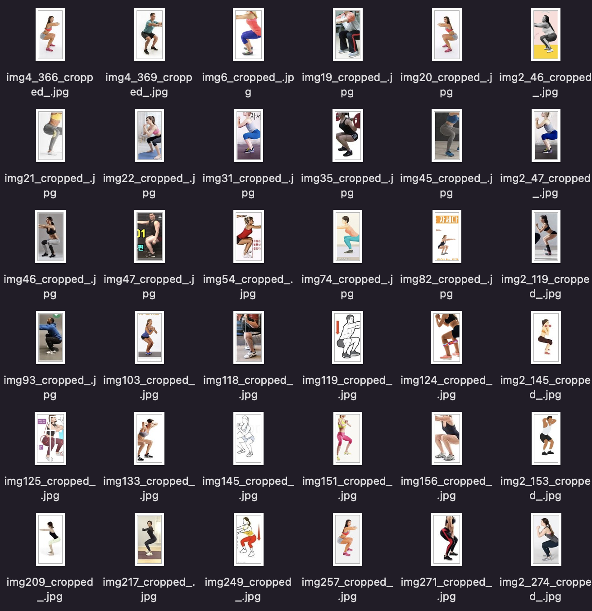
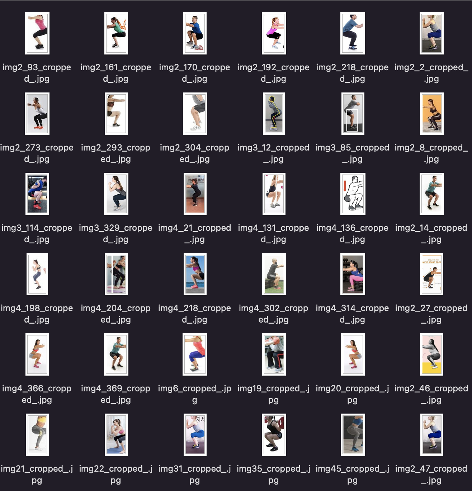

# __Real-Time Squat Counter__
## 🎈 __실시간 자세 피드백 및 운동 횟수 카운트 모델__

&nbsp;
## 🎈 __진행 프로젝트__
1. Human Detection
    * HOG 기반 SVM 분류기
1. Human Pose Classification
    * MoveNet
1. Human Pose Estimation
    * MediaPipe

&nbsp;
## 🎈 __프로젝트 진행 순서__
1. 데이터 수집
    * 웹 크롤링
    * 자체 데이터 촬영
1. 데이터 전처리
    * 객체 검출
1. 모델 학습
    * Human Pose Classification
    * Human Pose Estimation
1. 모델 평가

&nbsp;

## __🎈 1단계: <a href="https://github.com/sujin421/Artificial-Intelligence1-Project/blob/main/web%20crawling_human%20detector.ipynb" target="_blank">데이터 수집</a>__ 
### __1) 구글의 이미지 검색에서 스쿼트 이미지 크롤링__
* [Classification Datasets] 용량 문제로 구글 드라이브 링크로 공유합니다. 링크: https://drive.google.com/file/d/1jdBhbp3c_AzWQpBwgBhITqdq8vesLFuN/view?usp=sharing

### __2) 다양한 스쿼트 자세 자체 촬영__

&nbsp;
## 🎈 __2단계: 데이터 전처리__
### __객체 검출__
* HOG 기반 SVM 분류기를 이용하여 Human Detection

 

&nbsp;

## __🎈 3단계: 모델 학습__
### __1. 객체 분류 <a href="https://github.com/sujin421/Artificial-Intelligence1-Project/blob/main/Human%20Pose%20Classification.ipynb" target="_blank">Human Pose Classification</a>__
* MoveNet

&nbsp;
### __2. 포즈 추정 <a href="https://github.com/sujin421/Artificial-Intelligence1-Project/blob/main/Real-Time%20Squat%20Counter.ipynb" target="_blank">Human Pose Estimation</a>__
* MediaPipe

&nbsp;
## __🎈 4단계: 모델 평가__

* __Pose Classification__  
    __✏ confusion matrix__  

* __Pose Estimation__  

&nbsp;

## __🎈 DEMO__

&nbsp;

## __🎈 발전 및 개선 방향__
### __1) 3차원 좌표 추출__
* 다각도의 자세 피드백 기능 추가
### __2) 실시간 피드백 개선__
* 관절 별 자세 피드백
* 표준 각도 정확성 향상
### __3) 활용성 확장__
* 푸쉬업, 런지 등 타 운동 추가
* 사용자 중심 UI 개선
* 기기 호환 개선
